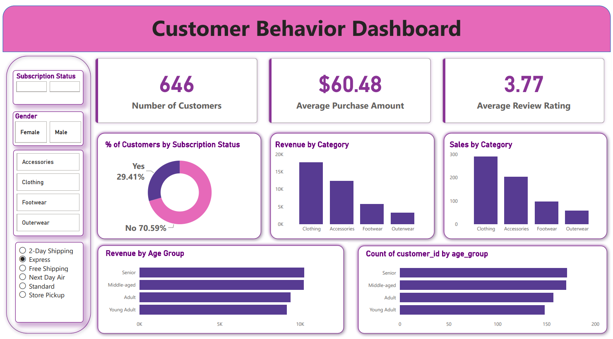

# 🛍️ Customer Shopping Behavior Analysis


An end-to-end **Data Analytics** project that analyzes customer shopping behavior using **Python, PostgreSQL, SQL, and Power BI**. The project uncovers customer purchasing patterns, identifies high-value customer segments, evaluates product performance, and provides actionable business insights to support data-driven decision-making.

---

# 📌 Business Problem

A leading retail company wants to better understand customer shopping behavior to improve:

- Customer Engagement
- Marketing Strategy
- Product Positioning
- Customer Retention
- Revenue Growth

### Business Question

> **How can the company leverage customer shopping data to identify trends, improve customer engagement, and optimize marketing and product strategies?**

---

# 📊 Dashboard Preview

The interactive Power BI dashboard provides a comprehensive overview of customer purchasing behavior and key business metrics.



---

# 📊 Dataset Overview

| Feature | Details |
|----------|---------|
| Dataset Size | 3,900 Records |
| Total Features | 18 Columns |
| Missing Values | 37 (Review Rating) |
| Domain | Retail / E-Commerce |
| Tools Used | Python, PostgreSQL, SQL, Power BI |

### Dataset Includes

- Customer Demographics
- Product Categories
- Purchase Amount
- Shopping Frequency
- Subscription Status
- Discounts & Promotions
- Shipping Preferences
- Product Reviews
- Seasonal Purchases

---

# 🛠️ Tech Stack

| Technology | Purpose |
|------------|---------|
| Python | Data Cleaning & Feature Engineering |
| Pandas | Data Manipulation |
| NumPy | Numerical Operations |
| PostgreSQL | Database Management |
| SQL | Business Analysis |
| Power BI | Dashboard & Data Visualization |
| Jupyter Notebook | Development Environment |

---

# 📂 Repository Structure

```
Customer-Shopping-Behavior-Analysis
│
├── Business Problem Document.pdf
├── Customer Shopping Behavior Analysis.pdf
├── Customer-Shopping-Behavior-Analysis.pptx
├── Customer_Shopping_Behavior_Analysis.ipynb
├── customer_behavior_dashboard.pbix
├── customer_behavior_dashboard.png
├── customer_behavior_sql_queries.sql
├── customer_shopping_behavior.csv
├── README.md
└── LICENSE
```

---

# 🔄 Project Workflow

```
Raw Dataset
      │
      ▼
Data Cleaning (Python)
      │
      ▼
Feature Engineering
      │
      ▼
PostgreSQL Database
      │
      ▼
SQL Business Analysis
      │
      ▼
Power BI Dashboard
      │
      ▼
Business Insights & Recommendations
```

---

# 🧹 Data Preparation

The dataset was cleaned and transformed using Python.

### Data Cleaning

- Imported the dataset using Pandas
- Performed exploratory data analysis
- Checked for missing values
- Imputed missing Review Rating values
- Renamed columns using snake_case
- Removed redundant columns
- Verified data consistency

### Feature Engineering

- Created customer Age Groups
- Generated Purchase Frequency feature
- Prepared clean data for SQL analysis

### Database Integration

- Connected Python with PostgreSQL
- Loaded cleaned data into PostgreSQL database

---

# 📈 SQL Business Analysis

Business questions solved using SQL:

- Revenue by Gender
- High-Spending Discount Users
- Top Rated Products
- Shipping Type Comparison
- Subscribers vs Non-Subscribers
- Discount Dependent Products
- Customer Segmentation
- Top Products by Category
- Repeat Buyers & Subscription Analysis
- Revenue by Age Group

---

# 📊 Power BI Dashboard

The interactive dashboard contains:

### KPI Cards

- Total Customers
- Average Purchase Amount
- Average Review Rating

### Charts

- Revenue by Category
- Sales by Category
- Revenue by Age Group
- Sales by Age Group
- Subscription Status Distribution

### Interactive Filters

- Gender
- Category
- Shipping Type
- Subscription Status

---

# 💡 Key Business Insights

- Male customers generated higher overall revenue than female customers.
- Express shipping customers spent more per transaction than standard shipping users.
- Loyal customers contributed significantly to total revenue.
- Young Adult customers generated the highest revenue.
- Certain products relied heavily on discounts for sales.
- Subscribers demonstrated stronger customer retention.

---

# 📌 Business Recommendations

- Expand customer loyalty programs.
- Improve subscription benefits.
- Optimize discount strategies.
- Promote top-rated products.
- Focus marketing campaigns on high-value customer segments.
- Encourage premium shipping options.

---

# 🚀 Skills Demonstrated

- Data Cleaning
- Exploratory Data Analysis (EDA)
- Feature Engineering
- SQL Query Optimization
- PostgreSQL
- Customer Segmentation
- Business Analytics
- Dashboard Design
- Data Visualization
- Business Storytelling
- Python Programming
- Power BI

---

# 📈 Future Enhancements

- Customer Lifetime Value Prediction
- Customer Churn Prediction
- Recommendation System
- Sales Forecasting
- RFM Analysis
- Machine Learning Models

---

# 📚 Learning Outcomes

Through this project, I gained hands-on experience in:

- Cleaning and transforming real-world datasets
- Writing optimized SQL queries
- Working with PostgreSQL databases
- Building interactive Power BI dashboards
- Solving business problems using data analytics
- Presenting insights through reports and visualizations

---

# ⭐ Repository Highlights

- ✅ End-to-End Data Analytics Project
- ✅ Python Data Cleaning
- ✅ PostgreSQL Database Integration
- ✅ Advanced SQL Business Queries
- ✅ Interactive Power BI Dashboard
- ✅ Business Recommendations
- ✅ Professional Documentation

---

# 👨‍💻 Author

## Siddhesh Shinde

**Data Analyst | Python | SQL | PostgreSQL | Power BI | Excel**

### Connect with Me

- 💻 **GitHub:** https://github.com/siddhesh1503
- 💼 **LinkedIn:** https://www.linkedin.com/in/siddhesh-shinde-9551922a9

If you found this project helpful, consider giving it a ⭐ on GitHub!


## ⭐ Support

If you like this project, don't forget to **Star ⭐ the repository**.

It helps others discover the project and motivates me to create more Data Analytics and Machine Learning projects.
